# 🩺 Explainable Multimodal Diagnostic Support System


> Chest X-ray diagnosis with fused clinical metadata, and visual explanations (Grad-CAM + occlusion-based counterfactuals) so the model's reasoning is inspectable instead of a black box.

🔗 **[Live Demo](https://multimodal-xai-diagnostic-yhqvbbhkejld2b6jodcvh2.streamlit.app)**

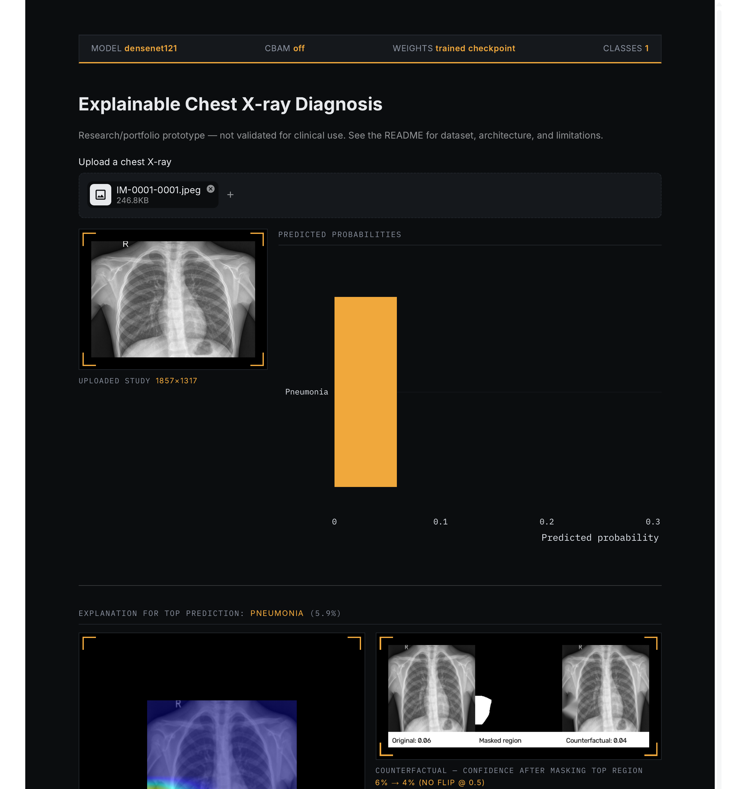

---

## Why this project

Clinical AI models are often accurate but opaque, which limits real-world trust. This project predicts pneumonia from pediatric chest X-rays **fused with patient vitals** (age, gender, temperature, SpO2 — see note below), and pairs every prediction with:

- A **Grad-CAM heatmap** showing which image regions drove the prediction.
- An **occlusion-based counterfactual view** showing how the model's confidence changes when the highlighted region is masked — an intuitive proxy for "what if this finding wasn't there?"

⚠️ **The tabular vitals (temperature, SpO2, age) are synthetically generated** — the source dataset ships images only, no real EHR data. They're simulated with clinically plausible correlations (fever/lower oxygen for pneumonia-positive cases) specifically to keep the fusion architecture genuinely meaningful to demonstrate. **See [`docs/ethics_statement.md`](docs/ethics_statement.md) before citing any results from this project** — this is disclosed prominently there and must be mentioned in any presentation of this work.

An ablation study (`notebooks/02_fusion_ablation_results.ipynb`) directly measures what the tabular metadata adds over the image alone. See [`docs/architecture.md`](docs/architecture.md) for full technical detail.

## Architecture

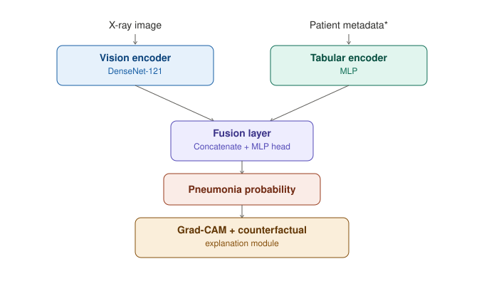

*synthetic — see [`docs/ethics_statement.md`](docs/ethics_statement.md)

## Tech stack

`PyTorch` · `torchvision` · `pydicom` · `grad-cam` · `Streamlit` · `pandas` / `scikit-learn`

## Dataset

[Chest X-ray Pneumonia (Kaggle)](https://www.kaggle.com/datasets/paultimothymooney/chest-xray-pneumonia) — 5,856 pediatric chest X-ray images (ages 1–5) from Guangzhou Women and Children's Medical Center, labeled Normal/Pneumonia. Tabular fusion inputs (age, gender, temperature, SpO2) are synthetically generated — see [`docs/ethics_statement.md`](docs/ethics_statement.md).

*(This project originally targeted the full [NIH Chest X-ray14](https://www.kaggle.com/datasets/nih-chest-xrays/data) dataset — 112k images, 14 classes, real patient metadata — switched to the above for local disk/compute constraints. See `configs/data_nih_legacy.yaml` and `docs/architecture.md#dataset-history`.)*

## Repository structure

```
multimodal-xai-diagnostic/
├── data/scripts/       # download & preprocessing scripts
├── src/
│   ├── data/            # Dataset / DataLoader classes
│   ├── models/           # vision encoder, tabular encoder, fusion model
│   └── explain/           # Grad-CAM + occlusion explainer
├── dashboard/            # Streamlit app
├── notebooks/            # EDA and results notebooks
├── tests/
└── docs/
```

## Setup

```bash
git clone https://github.com/<your-username>/multimodal-xai-diagnostic.git
cd multimodal-xai-diagnostic
python -m venv .venv && source .venv/bin/activate
pip install -r requirements.txt
```

## Explainability

Every prediction is paired with a **Grad-CAM heatmap** (`src/explain/gradcam.py`) showing which image regions drove the model's decision — built with [`pytorch-grad-cam`](https://github.com/jacobgil/pytorch-grad-cam), hooked into DenseNet-121's final dense block.

```bash
# Generate example Grad-CAM overlays from the test set
python src/explain/generate_examples.py --checkpoint checkpoints/vision_baseline/best_model.pth
```

| High-confidence Pneumonia (0.99) | Low-confidence / Normal (0.06) |
|---|---|
| 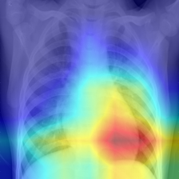 | 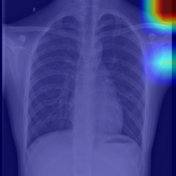 |

### A real finding: manual audit caught shortcut learning

Manually inspecting Grad-CAM outputs across several confident predictions found inconsistent localization — some examples showed a well-concentrated heatmap over lung tissue, but others showed activation spread outside the lung fields entirely, including one case with warm activation sitting directly on a burned-in laterality marker and timestamp. Full writeup with all examples in [`docs/ethics_statement.md`](docs/ethics_statement.md#observed-evidence-of-possible-shortcut-learning).

**Mitigation, verified working:** `src/explain/lung_segmentation.py` uses a pretrained chest X-ray segmentation model to constrain activation to the lung fields (`--restrict-to-lungs` flag). Compared below on the two worst offenders — same model, same image, before and after:

```bash
python src/explain/generate_examples.py --checkpoint checkpoints/vision_baseline/best_model.pth --restrict-to-lungs --output-dir docs/gradcam_examples_lung_restricted
```

| | Before (unrestricted) | After (lung-restricted) |
|---|---|---|
| **Diffuse, near-total saturation** | 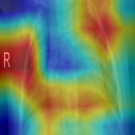 | 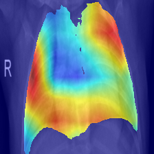 |
| **Activation on burned-in "R" marker/timestamp** | 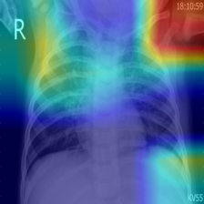 | 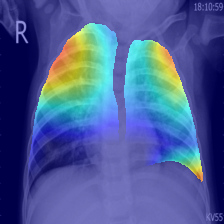 |

The lung boundary is now visibly carved into the mask in both cases, and the marker/timestamp in the second example no longer has any heat sitting on top of it. This constrains the *explanation* to anatomically valid regions — it doesn't necessarily fix whatever the model is doing internally, which is why the finding above stays documented rather than being quietly removed once "fixed."

**Counterfactual explanations** (`src/explain/counterfactual.py`) go a step further: the highest-activation region from Grad-CAM is inpainted out of the image, and the model is re-run on the result. A large confidence drop after removing that region is evidence the model's stated reasoning actually matches what's driving its prediction.

```bash
python src/explain/generate_counterfactual_examples.py --checkpoint checkpoints/vision_baseline/best_model.pth --strategy borderline
```

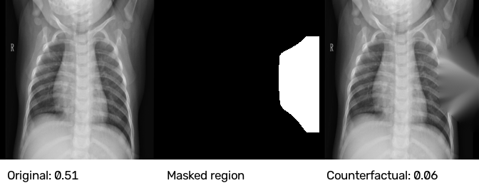
*Borderline-confidence prediction (0.510) flips to Normal (0.062) after masking the Grad-CAM region.*

Testing on the 6 most borderline (closest to the 0.5 decision boundary) test predictions — the hardest possible case for this method, since confident predictions rarely flip regardless of explanation quality — **1/6 flipped outright, and 4 of the remaining 5 still showed a substantial confidence drop** toward Normal after occlusion. This is consistent evidence that the highlighted region is doing real work in the model's decision, not just noise.

## Dashboard

The Streamlit dashboard (`dashboard/app.py`) ties everything together: upload an X-ray, see per-class probabilities, a Grad-CAM heatmap for the top prediction, and the occlusion-based counterfactual comparison, all in one view.

```bash
streamlit run dashboard/app.py
```

It runs out of the box even before training — if no checkpoint is found at `checkpoints/vision_baseline/best_model.pth`, it falls back to a randomly-initialized model with a clearly visible warning banner, so the UI is explorable immediately. Once you've trained the vision baseline, predictions become meaningful automatically — no code changes needed.

**Deploying a live demo:** free via [Streamlit Community Cloud](https://streamlit.io/cloud), with the trained checkpoint hosted on a free Hugging Face Hub model repo — see [`docs/deployment.md`](docs/deployment.md) for the full walkthrough (Hugging Face Spaces now requires a paid plan for Streamlit apps, so this repo doesn't use that path).

## Usage

```bash
# 1. Download and prepare the Chest X-ray Pneumonia dataset (requires a Kaggle
#    API token — see data/scripts/prepare_pneumonia_dataset.py for setup).
#    This single script downloads images, builds patient-level train/val/test
#    splits, and generates the synthetic tabular features — no separate
#    preprocessing step needed for this dataset.
python data/scripts/prepare_pneumonia_dataset.py

# 2. Train the vision baseline (DenseNet-121)
python src/train.py --data-config configs/data.yaml --train-config configs/vision_baseline.yaml

# 3. Evaluate on the test set and generate the results table
python src/evaluate.py --checkpoint checkpoints/vision_baseline/best_model.pth

# 4. Train the fusion model (vision + tabular metadata)
python src/train_fusion.py --data-config configs/data.yaml --train-config configs/fusion.yaml

# 5. Evaluate the fusion model and generate its results table
python src/evaluate_fusion.py --checkpoint checkpoints/fusion/best_model.pth

# 6. Launch the dashboard
streamlit run dashboard/app.py
```

View training curves and per-class AUROC in `notebooks/01_vision_baseline_results.ipynb`, and the vision-only vs. fusion ablation comparison in `notebooks/02_fusion_ablation_results.ipynb`.

Run the test suite with:
```bash
pytest tests/ -v
```

### Comparing with vs. without CBAM

Once you've trained a baseline (`use_cbam: false` in `configs/vision_baseline.yaml`), train again with `use_cbam: true` (the current default) and compare both accuracy and Grad-CAM localization quality:

```bash
# Evaluate both checkpoints' test macro AUROC
python src/evaluate.py --checkpoint checkpoints/vision_baseline/best_model_no_cbam.pth
python src/evaluate.py --checkpoint checkpoints/vision_baseline/best_model.pth

# Compare what fraction of each model's Grad-CAM heatmap energy falls inside
# the segmented lung field — the localization claim from the papers in
# docs/paper_notes.md, made measurable instead of eyeballed
python src/explain/measure_lung_localization.py --checkpoint checkpoints/vision_baseline/best_model_no_cbam.pth --output-csv docs/localization_no_cbam.csv
python src/explain/measure_lung_localization.py --checkpoint checkpoints/vision_baseline/best_model.pth --output-csv docs/localization_cbam.csv
```

### Attention-consistency training (built, not yet run on real data)

Beyond just measuring CBAM's localization after training, `src/train_attention_consistency.py` trains *toward* it directly — see [`docs/architecture.md`](docs/architecture.md#attention-consistency-training-experimental) for the full design and the tradeoffs involved. Implemented and verified end-to-end with synthetic data (13 new tests), but not yet trained on the real dataset — that needs real GPU time. To actually run it:

```bash
# One-time: cache lung masks for train+val (skip test — these masks are
# for a training loss, not evaluation)
python data/scripts/precompute_lung_masks.py --train-config configs/vision_attention_consistency.yaml

# Train
python src/train_attention_consistency.py --train-config configs/vision_attention_consistency.yaml

# The resulting checkpoint works with every existing script unmodified —
# same evaluate.py and measure_lung_localization.py used above
python src/evaluate.py --checkpoint checkpoints/vision_attention_consistency/best_model.pth
python src/explain/measure_lung_localization.py --checkpoint checkpoints/vision_attention_consistency/best_model.pth --output-csv docs/localization_attention_consistency.csv
```

## Roadmap

- [x] Repo scaffold, license, dependencies
- [x] Data download + preprocessing pipeline
- [x] Vision baseline (DenseNet-121)
- [x] Tabular fusion model
- [x] Grad-CAM explainability module
- [x] Occlusion-based counterfactual explainer
- [x] Streamlit dashboard
- [x] Deploy live demo (Streamlit Community Cloud)
- [x] CBAM attention module (retrained + benchmarked — see [Results](#results))
- [ ] Attention-consistency training (implemented, verified end-to-end on synthetic data, not yet run on the real dataset)

## Results

Vision baseline (DenseNet-121) and fusion model (vision + tabular metadata) per-class and macro AUROC on the held-out test set are generated by `src/evaluate.py` / `src/evaluate_fusion.py` and compared in:

- `notebooks/01_vision_baseline_results.ipynb` — vision-only training curves and per-class AUROC
- `notebooks/02_fusion_ablation_results.ipynb` — vision-only vs. fusion comparison (the core ablation result)

```bash
python src/evaluate.py --checkpoint checkpoints/vision_baseline/best_model.pth
python src/evaluate_fusion.py --checkpoint checkpoints/fusion/best_model.pth
jupyter notebook notebooks/02_fusion_ablation_results.ipynb
```

| Model | Test Macro AUROC |
|---|---|
| Vision-only baseline (DenseNet-121) | 0.9708 |
| Vision + Tabular fusion | **0.9860** |

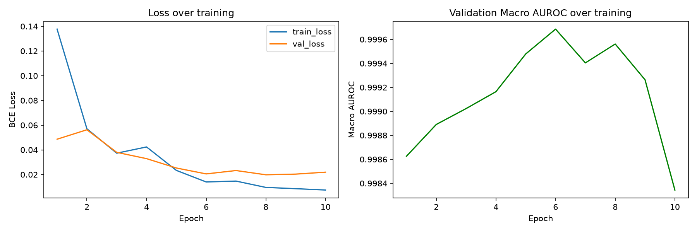

Fusion improves test AUROC by **+1.5 points** over vision-only. Since the tabular vitals (temperature, SpO2) are synthetically generated with a deliberate correlation to the label (see [`docs/ethics_statement.md`](docs/ethics_statement.md)), this result demonstrates that **the fusion architecture correctly learns to exploit correlated tabular signal when present** — a valid architecture-level finding, not a real clinical discovery. Both models substantially exceed random chance (0.5) and validation AUROC (~0.999), with the gap between val and test AUROC (~0.03) reflecting normal generalization variance on a modestly-sized (~5,800 image) test set.

### CBAM attention — what it adds, and why

**What it is:** `src/models/attention.py` implements CBAM (Convolutional Block
Attention Module, Woo et al., ECCV 2018) — a small, cheap module inserted
between the DenseNet-121 backbone and the classifier head. It does two things
to the feature map before classification:
1. **Channel attention** — decides which of the 1024 feature channels matter more for this input, and rescales them.
2. **Spatial attention** — decides which *pixels* matter more, and rescales those.

Total cost: ~2.1M extra parameters on a ~7M-parameter backbone. No change to
input/output shapes, so it's a drop-in addition — enabled or disabled purely
via the `use_cbam` config flag, with no other code changes needed.

**Why it was added:** this wasn't a generic "add an attention mechanism"
upgrade. Reading the pneumonia chest X-ray literature (6 papers, 2024–2026,
full notes in [`docs/paper_notes.md`](docs/paper_notes.md)) turned up a
specific, repeated finding on this exact backbone + dataset combination:
CBAM doesn't just improve classification accuracy, it also makes Grad-CAM
heatmaps concentrate more tightly on actual pathological lung regions
instead of drifting to shoulders, image borders, or annotations. That second
part is what made it worth adding *here specifically* — it's a direct,
literature-backed extension of the shortcut-learning problem already
documented in [`docs/ethics_statement.md`](docs/ethics_statement.md), not
just a routine accuracy play. CBAM was picked over the lighter SE-Net
alternative (which some of the same papers also use) precisely because
SE only does channel attention — the spatial term is what actually
targets *where* the model looks, which is the whole point here.

**Current status:** implemented, tested (10 tests across `test_attention.py`
and the CBAM cases in `test_vision_model.py`), `use_cbam: true` is the
default in both configs, and **retrained across 3 random seeds** per
condition (42, 123, 2024 — same data splits, same 15-epoch config, only
`use_cbam` and the seed different) to get a properly replicated comparison
instead of a single lucky (or unlucky) run.

**Test macro AUROC:**

| Seed | No CBAM | CBAM | Diff (CBAM − No CBAM) |
|---|---|---|---|
| 42 | 0.9592 | 0.9608 | +0.0016 |
| 123 | 0.9695 | 0.9445 | −0.0250 |
| 2024 | 0.9736 | 0.9604 | −0.0132 |
| **Mean ± std** | 0.9674 ± 0.0074 | 0.9552 ± 0.0093 | **−0.0122 ± 0.0139** |

One-sample t-test on the 3 seed-level differences vs. 0: t=−1.59, **p=0.25 (not significant, n=3)**

**Mean Grad-CAM lung-energy fraction** (fraction of heatmap energy inside the segmented lung field; paired within each seed, NaN images dropped):

| Seed | No CBAM | CBAM | Diff (CBAM − No CBAM) |
|---|---|---|---|
| 42 | 0.415 | 0.511 | +0.098 |
| 123 | 0.463 | 0.572 | +0.109 |
| 2024 | 0.498 | 0.470 | −0.028 |
| **Mean ± std** | — | — | **+0.060 ± 0.076** |

One-sample t-test on the 3 seed-level differences vs. 0: t=1.36, **p=0.31 (not significant, n=3)**

**The honest reading — including a correction to our own earlier analysis:**
An initial single-seed comparison (seed 42 only) reported the localization
improvement as highly significant (p=0.0013). That number was
**pseudo-replicated** — it treated 26 images from *one* trained model as 26
independent experiments, when they all share the same weights and are
correlated with each other. The statistically correct unit of replication
here is the *training run* (seed), not the image. Redone properly across 3
seeds: **2 of 3 seeds show a real localization improvement (seeds 42 and
123, both ~+0.10), but one shows a decline (seed 2024, −0.03)**, and with
only 3 replicates the mean effect (+0.060 ± 0.076) isn't statistically
distinguishable from noise (p=0.31). Accuracy tells a similar story in the
other direction — a small, non-significant *decrease* on average
(−0.012 ± 0.014, p=0.25), driven mostly by one seed (123) where CBAM
underperformed by 2.5 points.

**The fair summary:** there's a real trend toward better Grad-CAM
localization with CBAM, consistent with the literature review
([`docs/paper_notes.md`](docs/paper_notes.md)), but n=3 seeds isn't enough
to call it proven, and it does not come for free — accuracy doesn't
reliably improve and may trend slightly worse. This is a more honest
(and more useful) finding than a suspiciously clean single-run result would
have been: it shows the effect is real-ish but not dramatic, and that
claiming statistical significance from within-model image variance is a
mistake worth catching rather than repeating.

Visual example — index 272, seed 42, same test image, both checkpoints
(illustrative of the seed-42 result specifically, not a population-level claim):

| No CBAM | CBAM |
|---|---|
| 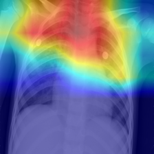 | 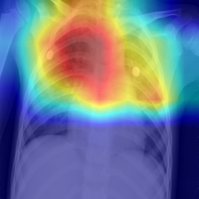 |

The no-CBAM heatmap extends up over the shoulder/clavicle, outside the
actual lung field; the CBAM version sits more centrally over the upper
chest. Not every image improved even within this one seed — index 479 (the
low-confidence "normal" case) is a fair counterexample where CBAM's heatmap,
while measurable, still lands mostly outside the ribcage. Full per-image
numbers for all three seeds: [`docs/localization_no_cbam.csv`](docs/localization_no_cbam.csv) /
[`docs/localization_cbam.csv`](docs/localization_cbam.csv) (seed 42),
[`docs/localization_no_cbam_seed123.csv`](docs/localization_no_cbam_seed123.csv) /
[`docs/localization_cbam_seed123.csv`](docs/localization_cbam_seed123.csv),
[`docs/localization_no_cbam_seed2024.csv`](docs/localization_no_cbam_seed2024.csv) /
[`docs/localization_cbam_seed2024.csv`](docs/localization_cbam_seed2024.csv).

### CBAM on the fusion model — a genuinely different result

Explainability was extended to the fusion model too
(`src/explain/fusion_wrapper.py` — see
[`docs/architecture.md`](docs/architecture.md) for how), so the same
3-seed CBAM comparison was repeated on fusion instead of just vision. The
result does **not** match the vision-only finding, and that mismatch is
itself the interesting part.

**Grad-CAM lung-energy fraction (CBAM − No CBAM):**

| Seed | No CBAM | CBAM | Diff |
|---|---|---|---|
| 42 | 0.451 | 0.516 | +0.065 |
| 123 | 0.489 | 0.393 | −0.096 |
| 2024 | 0.444 | 0.476 | +0.032 |
| **Mean ± std** | — | — | **+0.0003 ± 0.085** |

One-sample t-test (n=3 seeds): t=0.007, **p=0.995**

**Test macro AUROC (CBAM − No CBAM):**

| Seed | No CBAM | CBAM | Diff |
|---|---|---|---|
| 42 | 0.9935 | 0.9921 | −0.0014 |
| 123 | 0.9795 | 0.9915 | +0.0120 |
| 2024 | 0.9816 | 0.9899 | +0.0083 |
| **Mean ± std** | 0.9849 ± 0.0076 | 0.9912 ± 0.0011 | **+0.0063 ± 0.0071** |

One-sample t-test (n=3 seeds): t=1.58, **p=0.26**

**The honest read:** on fusion, CBAM's effect on localization is essentially
a wash — the three seeds nearly perfectly cancel out (mean ≈ 0.0003),
unlike vision where there was at least a noisy positive trend. Accuracy
trends mildly *positive* here (opposite direction from vision's mild
negative trend), though still not significant at n=3. Put plainly: **CBAM's
effect appears to depend on which model it's attached to** — the vision-only
finding does not generalize to the fusion model, and this project isn't
going to pretend otherwise just because a consistent story would look
cleaner. Full per-image numbers: [`docs/localization_fusion_no_cbam_seed42.csv`](docs/localization_fusion_no_cbam_seed42.csv) /
[`docs/localization_fusion_cbam_seed42.csv`](docs/localization_fusion_cbam_seed42.csv),
[`docs/localization_fusion_no_cbam_seed123.csv`](docs/localization_fusion_no_cbam_seed123.csv) /
[`docs/localization_fusion_cbam_seed123.csv`](docs/localization_fusion_cbam_seed123.csv),
[`docs/localization_fusion_no_cbam_seed2024.csv`](docs/localization_fusion_no_cbam_seed2024.csv) /
[`docs/localization_fusion_cbam_seed2024.csv`](docs/localization_fusion_cbam_seed2024.csv).

Visual example — index 272 (the same image used in the vision-side example
above), fusion model with CBAM:

| Grad-CAM | Counterfactual |
|---|---|
| 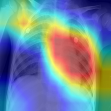 | 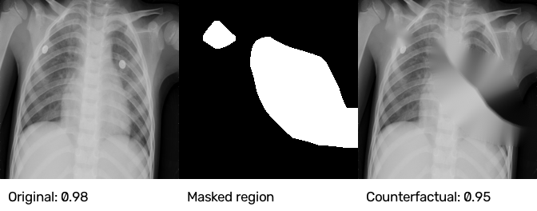 |

The heatmap sits in the lower-right chest with rib shadows visible through
it — reasonably contained within lung tissue. The counterfactual is the
more interesting part: masking the top-attended region only drops
confidence from 0.98 to 0.95 (no flip). For the vision-only model, a small
drop like that would usually suggest the model wasn't strongly relying on
that region. But **that read doesn't transfer cleanly to fusion** — masking
the image leaves the patient's tabular vitals untouched, so a small drop
could just as easily mean the model is genuinely drawing on both modalities
for this prediction, which is exactly what a fusion model is supposed to
do. Counterfactual masking is a noisier signal for a multimodal model than
for a vision-only one, and this project isn't going to claim otherwise.

## Limitations & Ethics

This is a research/portfolio prototype trained on a public dataset and is **not validated for clinical use**. See [`docs/ethics_statement.md`](docs/ethics_statement.md) for a full discussion of dataset limitations, explainability caveats, and intended use.

## Deploying a live demo

See [`docs/deployment.md`](docs/deployment.md) for step-by-step instructions to deploy the dashboard for free.

## License

MIT — see [LICENSE](LICENSE).
