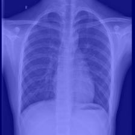

# 🩺 Explainable Multimodal Diagnostic Support System

🔗 **[Live Demo](https://multimodal-xai-diagnostic-nupdkmnbnjfrfg2yuydlqx.streamlit.app)**


> Chest X-ray diagnosis with fused clinical metadata, and visual explanations (Grad-CAM + occlusion-based counterfactuals) so the model's reasoning is inspectable instead of a black box.

<!-- 🔗 Live Demo link goes here once deployed — see docs/deployment.md -->

<!-- 🖼️ Dashboard demo GIF/screenshot goes here once built -->

---

## Why this project

Clinical AI models are often accurate but opaque, which limits real-world trust. This project predicts pneumonia from pediatric chest X-rays **fused with patient vitals** (age, gender, temperature, SpO2 — see note below), and pairs every prediction with:

- A **Grad-CAM heatmap** showing which image regions drove the prediction.
- An **occlusion-based counterfactual view** showing how the model's confidence changes when the highlighted region is masked — an intuitive proxy for "what if this finding wasn't there?"

⚠️ **The tabular vitals (temperature, SpO2, age) are synthetically generated** — the source dataset ships images only, no real EHR data. They're simulated with clinically plausible correlations (fever/lower oxygen for pneumonia-positive cases) specifically to keep the fusion architecture genuinely meaningful to demonstrate. **See [`docs/ethics_statement.md`](docs/ethics_statement.md) before citing any results from this project** — this is disclosed prominently there and must be mentioned in any presentation of this work.

An ablation study (`notebooks/02_fusion_ablation_results.ipynb`) directly measures what the tabular metadata adds over the image alone. See [`docs/architecture.md`](docs/architecture.md) for full technical detail.

## Architecture

```
                ┌────────────────────┐
   X-ray image →│  Vision Encoder     │──┐
                │  (DenseNet-121)     │  │
                └────────────────────┘  │      ┌───────────────┐      ┌─────────────────────┐
                                         ├─────▶│ Fusion Layer   │────▶│ Pneumonia Probability │
                ┌────────────────────┐  │      └───────────────┘      └─────────────────────┘
  Patient meta →│  Tabular Encoder    │──┘              │
  (age, gender, │  (MLP)              │                 ▼
  temp, SpO2*)  └────────────────────┘        ┌───────────────────────┐
                                               │ Grad-CAM + Occlusion   │
                                               │ Explanation Module     │
                                               └───────────────────────┘
```
*synthetic — see [`docs/ethics_statement.md`](docs/ethics_statement.md)

*(Diagram will be replaced with a proper Excalidraw export in `docs/` once the pipeline is finalized.)*

## Tech stack

`PyTorch` · `torchvision` · `pydicom` · `grad-cam` · `Streamlit` · `pandas` / `scikit-learn`

## Dataset

[Chest X-ray Pneumonia (Kaggle)](https://www.kaggle.com/datasets/paultimothymooney/chest-xray-pneumonia) — 5,856 pediatric chest X-ray images (ages 1–5) from Guangzhou Women and Children's Medical Center, labeled Normal/Pneumonia. Tabular fusion inputs (age, gender, temperature, SpO2) are synthetically generated — see [`docs/ethics_statement.md`](docs/ethics_statement.md).

*(This project originally targeted the full [NIH Chest X-ray14](https://www.kaggle.com/datasets/nih-chest-xrays/data) dataset — 112k images, 14 classes, real patient metadata — switched to the above for local disk/compute constraints. See `configs/data_nih_legacy.yaml` and `docs/architecture.md#dataset-history`.)*

## Repository structure

```
multimodal-xai-diagnostic/
├── data/scripts/       # download & preprocessing scripts
├── src/
│   ├── data/            # Dataset / DataLoader classes
│   ├── models/           # vision encoder, tabular encoder, fusion model
│   └── explain/           # Grad-CAM + occlusion explainer
├── dashboard/            # Streamlit app
├── notebooks/            # EDA and results notebooks
├── tests/
└── docs/
```

## Setup

```bash
git clone https://github.com/<your-username>/multimodal-xai-diagnostic.git
cd multimodal-xai-diagnostic
python -m venv .venv && source .venv/bin/activate
pip install -r requirements.txt
```

## Explainability

Every prediction is paired with a **Grad-CAM heatmap** (`src/explain/gradcam.py`) showing which image regions drove the model's decision — built with [`pytorch-grad-cam`](https://github.com/jacobgil/pytorch-grad-cam), hooked into DenseNet-121's final dense block.

```bash
# Generate example Grad-CAM overlays from the test set
python src/explain/generate_examples.py --checkpoint checkpoints/vision_baseline/best_model.pth
```

| High-confidence Pneumonia (0.99) | Low-confidence / Normal (0.06) |
|---|---|
|  |  |

**Counterfactual explanations** (`src/explain/counterfactual.py`) go a step further: the highest-activation region from Grad-CAM is inpainted out of the image, and the model is re-run on the result. A large confidence drop after removing that region is evidence the model's stated reasoning actually matches what's driving its prediction.

```bash
python src/explain/generate_counterfactual_examples.py --checkpoint checkpoints/vision_baseline/best_model.pth --strategy borderline
```


*Borderline-confidence prediction (0.510) flips to Normal (0.062) after masking the Grad-CAM region.*

Testing on the 6 most borderline (closest to the 0.5 decision boundary) test predictions — the hardest possible case for this method, since confident predictions rarely flip regardless of explanation quality — **1/6 flipped outright, and 4 of the remaining 5 still showed a substantial confidence drop** toward Normal after occlusion. This is consistent evidence that the highlighted region is doing real work in the model's decision, not just noise.

## Dashboard

The Streamlit dashboard (`dashboard/app.py`) ties everything together: upload an X-ray, see per-class probabilities, a Grad-CAM heatmap for the top prediction, and the occlusion-based counterfactual comparison, all in one view.

```bash
streamlit run dashboard/app.py
```

It runs out of the box even before training — if no checkpoint is found at `checkpoints/vision_baseline/best_model.pth`, it falls back to a randomly-initialized model with a clearly visible warning banner, so the UI is explorable immediately. Once you've trained the vision baseline, predictions become meaningful automatically — no code changes needed.

<!-- 🖼️ Dashboard screenshot/GIF goes here once you have a trained model to demo -->

**Deploying a live demo:** free via [Streamlit Community Cloud](https://streamlit.io/cloud), with the trained checkpoint hosted on a free Hugging Face Hub model repo — see [`docs/deployment.md`](docs/deployment.md) for the full walkthrough (Hugging Face Spaces now requires a paid plan for Streamlit apps, so this repo doesn't use that path). Link the live demo at the top of this README once deployed.

## Usage

```bash
# 1. Download and prepare the Chest X-ray Pneumonia dataset (requires a Kaggle
#    API token — see data/scripts/prepare_pneumonia_dataset.py for setup).
#    This single script downloads images, builds patient-level train/val/test
#    splits, and generates the synthetic tabular features — no separate
#    preprocessing step needed for this dataset.
python data/scripts/prepare_pneumonia_dataset.py

# 2. Train the vision baseline (DenseNet-121)
python src/train.py --data-config configs/data.yaml --train-config configs/vision_baseline.yaml

# 3. Evaluate on the test set and generate the results table
python src/evaluate.py --checkpoint checkpoints/vision_baseline/best_model.pth

# 4. Train the fusion model (vision + tabular metadata)
python src/train_fusion.py --data-config configs/data.yaml --train-config configs/fusion.yaml

# 5. Evaluate the fusion model and generate its results table
python src/evaluate_fusion.py --checkpoint checkpoints/fusion/best_model.pth

# 6. Launch the dashboard
streamlit run dashboard/app.py
```

View training curves and per-class AUROC in `notebooks/01_vision_baseline_results.ipynb`, and the vision-only vs. fusion ablation comparison in `notebooks/02_fusion_ablation_results.ipynb`.

Run the test suite with:
```bash
pytest tests/ -v
```

## Roadmap

- [x] Repo scaffold, license, dependencies
- [x] Data download + preprocessing pipeline
- [x] Vision baseline (DenseNet-121)
- [x] Tabular fusion model
- [x] Grad-CAM explainability module
- [x] Occlusion-based counterfactual explainer
- [x] Streamlit dashboard
- [ ] Deploy live demo (Streamlit Community Cloud)

## Results

Vision baseline (DenseNet-121) and fusion model (vision + tabular metadata) per-class and macro AUROC on the held-out test set are generated by `src/evaluate.py` / `src/evaluate_fusion.py` and compared in:

- `notebooks/01_vision_baseline_results.ipynb` — vision-only training curves and per-class AUROC
- `notebooks/02_fusion_ablation_results.ipynb` — vision-only vs. fusion comparison (the core ablation result)

```bash
python src/evaluate.py --checkpoint checkpoints/vision_baseline/best_model.pth
python src/evaluate_fusion.py --checkpoint checkpoints/fusion/best_model.pth
jupyter notebook notebooks/02_fusion_ablation_results.ipynb
```

| Model | Test Macro AUROC |
|---|---|
| Vision-only baseline (DenseNet-121) | 0.9708 |
| Vision + Tabular fusion | **0.9860** |


Fusion improves test AUROC by **+1.5 points** over vision-only. Since the tabular vitals (temperature, SpO2) are synthetically generated with a deliberate correlation to the label (see [`docs/ethics_statement.md`](docs/ethics_statement.md)), this result demonstrates that **the fusion architecture correctly learns to exploit correlated tabular signal when present** — a valid architecture-level finding, not a real clinical discovery. Both models substantially exceed random chance (0.5) and validation AUROC (~0.999), with the gap between val and test AUROC (~0.03) reflecting normal generalization variance on a modestly-sized (~5,800 image) test set.

## Limitations & Ethics

This is a research/portfolio prototype trained on a public dataset and is **not validated for clinical use**. See [`docs/ethics_statement.md`](docs/ethics_statement.md) for a full discussion of dataset limitations, explainability caveats, and intended use.

## Deploying a live demo

See [`docs/deployment.md`](docs/deployment.md) for step-by-step instructions to deploy the dashboard for free.

## License

MIT — see [LICENSE](LICENSE).
