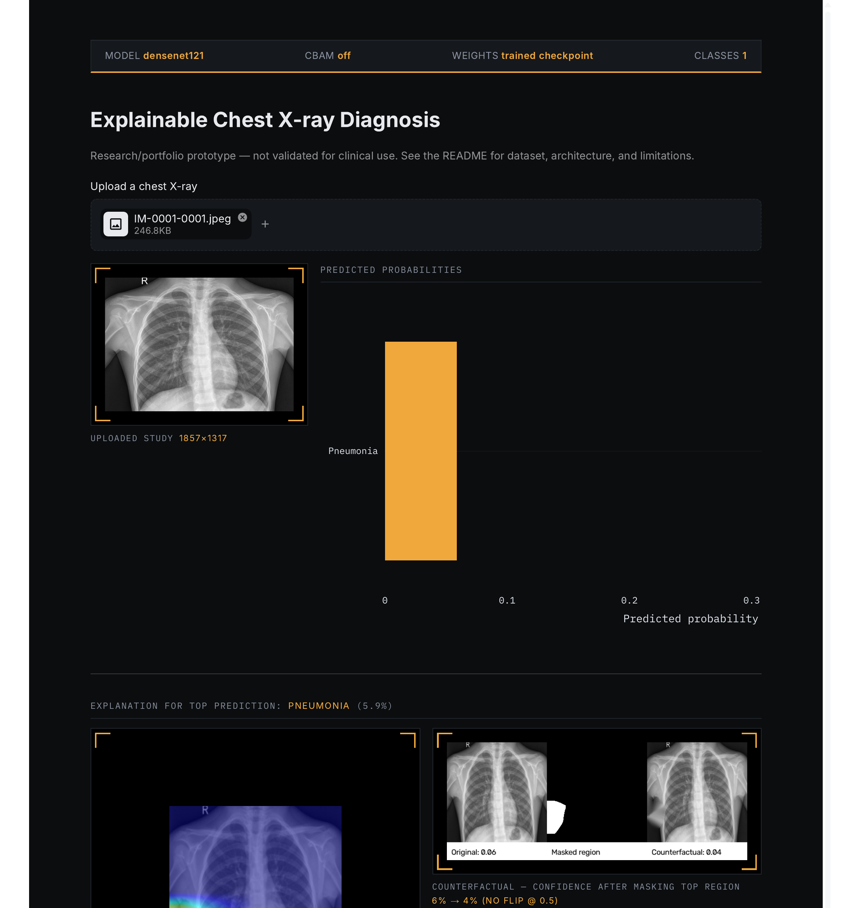

# Explainable Multimodal Diagnostic Support System

An explainable multimodal deep learning pipeline for pediatric pneumonia detection from chest X-rays and clinical metadata. Built as part of my M.Tech (AI) work at Bennett University.

The core idea: it's not enough for a model to say "pneumonia". I wanted to know *where* it's looking, whether that changes with how the model is trained, and whether its confidence scores can be trusted. So this project combines a DenseNet-121 classifier with Grad-CAM, CBAM and SE attention, occlusion-based counterfactuals, lung-localization scoring, an attention-consistency loss that pushes the model to look inside the lungs, a calibration analysis with three attempted fixes, and a controlled comparison against a published paper that reports much higher accuracy on the same dataset.

[](https://github.com/mkshitizreddy-ctrl/multimodal-xai-diagnostic/actions)

Python 3.11+ · MIT License

[Live demo](https://multimodal-xai-diagnostic-yhqvbbhkejld2b6jodcvh2.streamlit.app)



---

## Summary of findings

- **Attention-consistency training improves localization at a measurable ranking cost.** Across 5 seeds, lung localization increases by **+0.0833 ± 0.0612** while AUROC decreases by **-0.0639 ± 0.0323**. Paired tests give **p = 0.038** for localization and **p = 0.012** for AUROC.
- **CBAM alone does not reliably improve the vision model.** Across 5 seeds, CBAM vs. no attention gives an AUROC difference of **-0.0037 (p = 0.67)** and localization difference of **+0.029 (p = 0.57)**.
- **SE shows the highest mean AUROC and localization among the three attention configurations, but the differences are not statistically confirmed.** SE vs. no attention gives **+0.0037 AUROC (p = 0.72)** and **+0.040 localization (p = 0.16)**; SE vs. CBAM gives **+0.0073 AUROC (p = 0.099)** and **+0.011 localization (p = 0.84)**.
- **The models are overconfident.** Baseline ECE is **0.136** for vision and **0.135** for fusion. Of three calibration fixes, training-time label smoothing produced the clearest improvement in calibration without a statistically confirmed AUROC change.
- **The published 98.6% result is highly sensitive to split methodology.** Under a split matching the published paper's described sizes, **304 of 480 test images (63%) share a patient identifier with the training set**. This project's unchanged DenseNet-121 + CBAM model reaches **97.22% mean accuracy** on that split versus **86.38%** on the project's patient-level split.
- **A reproducibility bug was found and fixed.** `torch.manual_seed()` alone did not make training deterministic because Python's `random`, DataLoader workers, and cuDNN nondeterminism were not fully controlled. The project now uses centralized deterministic seeding.

## Why this project

Medical imaging models can hit strong accuracy numbers while giving almost no insight into *why* they made a call, and a model that is right for the wrong reasons is still a liability. So alongside the classifier I built explainability tools and used them to interrogate the model instead of trusting heatmaps at face value.

**Note on the data:** the chest X-ray dataset has no real patient vitals, so the tabular features used for multimodal fusion (age, gender, temperature, SpO₂) are synthetic, generated with clinically plausible correlations to the label. They test the *architecture*, not any real diagnostic benefit. See `docs/ethics_statement.md`.

## Research questions

- Can DenseNet-121 classify pneumonia from chest X-rays accurately?
- Does adding tabular data help over image-only?
- Does Grad-CAM land on clinically relevant regions, or is the model cheating?
- Do CBAM or SE attention improve classification or localization, and does that hold up across seeds?
- Can I explicitly train attention to stay inside the lungs, and what does that cost?
- Are the model's confidence scores trustworthy, and can a standard fix repair them?
- Does a published paper's much higher accuracy on the same dataset hold up when the split methodology is controlled for?

## What's in here

**Vision model:** DenseNet-121, patient-level train/val splitting, binary classification, evaluated on accuracy, precision, recall, F1, AUROC and AUPR.

**Multimodal fusion:** image representation + tabular encoder + fusion head, to compare image-only against fused.

**Explainability:** Grad-CAM, occlusion-based counterfactuals, lung-field localization scoring, attention-map analysis.

**Attention modelling:** CBAM (channel + spatial) and SE (channel only), an attention-consistency loss trained against precomputed lung masks, all compared across multiple seeds.

**Calibration:** ECE and reliability diagrams, temperature scaling, isotonic regression, label smoothing, paired-bootstrap significance checks.

**External comparison:** a two-sided comparison against Potharaju et al. 2025: the project's model under their described split protocol, and their precisely specified SE idea evaluated within this project's patient-level protocol.

**Engineering:** configurable training with CLI overrides, deterministic seeding, automated evaluation scripts, GitHub Actions CI, tests, and a Streamlit dashboard.

## Architecture

```text
                    Chest X-ray Image
                            │
                            ▼
                     DenseNet-121
              (optional CBAM or SE attention)
                            │
                            ▼
                  Image Representation ──────┐
                                              │
              Synthetic Clinical Features     │
                            │                 │
                            ▼                 │
                    Tabular Encoder           │
                            │                 │
                            └────► Fusion Network
                                              │
                                              ▼
                                  Pneumonia Prediction

              Explainability layer:
              Grad-CAM · CBAM spatial attention ·
              Lung localization · Counterfactuals ·
              Attention-consistency analysis · Calibration
```

Full diagram and writeup: `docs/architecture.md`

## Dataset

Chest X-ray Pneumonia dataset (pediatric, ~1–5 years, Guangzhou Women and Children's Medical Center): 5,856 images, Normal vs. Pneumonia. I originally planned to use NIH ChestX-ray14 but switched given local compute and storage limits.

Patient-level splitting where possible (pneumonia filenames carry patient IDs; normal-class images don't, so I conservatively treated each as a unique patient):

- Train: ~4,434
- Val: ~798
- Test: ~624 (the original dataset test split, kept as-is)

This split matters more than it looks. See "Comparison against a published paper" for what happens when the split protocol allows patient overlap.

## Stack

Python 3.11+, PyTorch, Torchvision, DenseNet-121, CBAM, SE, scikit-learn, Pandas, NumPy, Grad-CAM, Streamlit, OpenCV/PIL, pytest

## Repo layout

```text
multimodal-xai-diagnostic/
├── data/
│   ├── scripts/              # dataset prep, lung-mask precomputation, Potharaju-style split
│   └── processed_potharaju_split/   # CSVs for the published-protocol comparison split
├── src/
│   ├── data/                 # dataset classes
│   ├── models/               # vision encoder, fusion, CBAM + SE (attention.py), attention-consistency loss
│   ├── explain/              # Grad-CAM, counterfactuals, lung segmentation/localization
│   ├── seeding.py            # deterministic seeding for all training scripts
│   ├── train.py, train_fusion.py, train_attention_consistency.py
│   ├── evaluate*.py, evaluate_calibration.py, fit_temperature.py, fit_isotonic.py,
│   │   compare_auroc_paired.py
├── dashboard/app.py          # Streamlit demo
├── notebooks/                # baseline + fusion ablation results
├── configs/                  # one YAML per experiment
├── tests/
├── docs/                     # architecture, ethics, per-run result CSVs, potharaju_comparison.md, paper drafts
└── CHANGELOG.md
```

Model checkpoints (`checkpoints/`) and training logs (`logs/`) are gitignored.

## Results

Test set **n = 624**, threshold **0.5** (never tuned on test). The classification results below report **Accuracy, Precision, Recall, F1, AUROC and AUPR** where those metrics were evaluated. Bootstrap confidence intervals are retained in the corresponding CSV artifacts under `docs/`.

| Model / Experiment | Accuracy | Precision | Recall | F1 | AUROC | AUPR |
| ------------------- | -------: | --------: | -----: | --: | -----: | ----: |
| Vision + CBAM (baseline) | 86.38% | 0.8224 | 0.9974 | 0.9015 | 0.9604 | 0.9628 |
| Vision + rotation/zoom | 73.88% | 0.7052 | 1.0000 | 0.8271 | 0.9651 | 0.9730 |
| Vision + label smoothing 0.05 | 87.98% | 0.8402 | 0.9974 | 0.9121 | 0.9574 | 0.9635 |
| Vision + label smoothing 0.1 | 86.06% | 0.8203 | 0.9949 | 0.8992 | 0.9459 | 0.9502 |
| Vision + label smoothing 0.2 | 91.03% | 0.8795 | 0.9923 | 0.9325 | 0.9652 | 0.9665 |
| Multimodal fusion | 87.02% | 0.8280 | 1.0000 | 0.9059 | 0.9899 | 0.9921 |
| Fusion + label smoothing 0.1 | 86.54% | 0.8255 | 0.9949 | 0.9023 | 0.9927 | 0.9959 |

These are single-seed (42) numbers. Baseline 95% bootstrap CIs include:

- Vision AUROC: **[0.9412, 0.9757]**
- Fusion AUROC: **[0.9810, 0.9961]**

The vision and fusion accuracy and F1 intervals overlap, so the apparent ranking difference should not be over-interpreted. The tabular features are synthetic, so the fusion result demonstrates architectural behavior rather than clinical benefit from real patient measurements.

Rotation/zoom augmentation *raises* AUROC/AUPR but sharply lowers accuracy and F1, which is why I don't call something an improvement because one number went up. Recall is at or near 1.0 for almost every model at the 0.5 threshold, so precision and accuracy are what vary most.

## Explainability findings

**Grad-CAM** sometimes landed on the lungs and sometimes didn't: a few cases lit up shoulders, image borders, or burned-in annotations. That motivated the localization work. A good accuracy number doesn't mean the model is looking at the right thing.

**Lung-restricted explanations:** using a pretrained segmentation model, Grad-CAM can be constrained to the lung field for visualization (`--restrict-to-lungs`). That constrains what you *see*, not necessarily what the classifier learned from.

**Counterfactuals:** occlude the highest-activation region and re-run the model. Across 6 borderline predictions, 1 flipped outright and 4 of the remaining 5 showed a real confidence drop. Not causal proof, but supporting evidence that the highlighted regions matter.

**Localization metric:** the lung-energy fraction is the share of Grad-CAM activation inside the lung mask, measured on a fixed random sample of 30 test images. Images with an all-zero heatmap are dropped, so each score is a mean over roughly 20–26 images.

## Attention mechanisms: CBAM vs. SE vs. none (5 seeds)

Seeds 42, 123, 2024, 7, 2025, vision model only, all trained under deterministic seeding (`src/seeding.py`) so this comparison doesn't carry the mixed-regime caveat earlier versions of this project did.

Test AUROC:

| Seed | No attention | CBAM | SE |
|---|---:|---:|---:|
| 42 | 0.9629 | 0.9620 | 0.9663 |
| 123 | 0.9675 | 0.9377 | 0.9508 |
| 2024 | 0.9630 | 0.9562 | 0.9744 |
| 7 | 0.9629 | 0.9619 | 0.9657 |
| 2025 | 0.9706 | 0.9614 | 0.9588 |
| Mean ± SD | 0.9654 ± 0.0035 | 0.9558 ± 0.0104 | 0.9632 ± 0.0089 |

Lung-energy localization:

| Seed | No attention | CBAM | SE |
|---|---:|---:|---:|
| 42 | 0.406 | 0.546 | 0.406 |
| 123 | 0.409 | 0.513 | 0.505 |
| 2024 | 0.491 | 0.475 | 0.452 |
| 7 | 0.418 | 0.310 | 0.505 |
| 2025 | 0.458 | 0.424 | 0.526 |
| Mean ± SD | 0.436 ± 0.037 | 0.454 ± 0.092 | 0.479 ± 0.049 |

Paired t-tests (n = 5):

| Comparison | AUROC diff | p | Localization diff | p |
|---|---:|---:|---:|---:|
| CBAM vs. none | -0.0095 | 0.147 | +0.017 | 0.73 |
| SE vs. none | -0.0022 | 0.70 | +0.042 | 0.18 |
| SE vs. CBAM | +0.0074 | 0.117 | +0.025 | 0.68 |

**CBAM shows no reliable effect on either metric.** This holds up whether you look at the original 3-seed sweep, a later 5-seed version run before the seeding fix, or this fully consistent 5-seed version: the direction and size of the effect move around across versions (even flipping sign on AUROC at times), but it's never close to significant. An even earlier single-run result (p = 0.0013) turned out to be **pseudo-replication**: treating individual images as independent replicates when the real unit of replication is the training run. No-attention's own variance also shrank sharply once seeding was consistent (AUROC SD 0.018 → 0.0035), which is itself informative: a fair amount of the apparent seed-to-seed spread in earlier versions of this comparison was coming from inconsistent seeding, not just genuine architecture variance.

**SE** has the best mean AUROC and best mean localization of the three, and the SE-vs-CBAM AUROC comparison (p = 0.117) is the closest to conventional significance of any attention comparison in this project, though still short of it. I read this as a real but unconfirmed signal, not a result to lean on.

On the **fusion model** (3 seeds, run before the seeding fix), CBAM's localization effect was essentially zero (+0.0003 ± 0.085, p = 0.995), so whatever CBAM does is architecture-dependent. This comparison has not been rerun under deterministic seeding.

## Attention-consistency training

Instead of hoping CBAM's attention lands on the lungs, I added a loss term (`1 − lung_energy_fraction`) that pushes its spatial attention toward precomputed lung masks (weight 0.1 unless stated).

Five seeds, all trained under deterministic seeding, compared against the matching v2 CBAM baseline at the same seed:

| Seed | CBAM AUROC | + attn.-consistency | Diff | CBAM loc. | + attn.-consistency | Diff |
|---|---:|---:|---:|---:|---:|---:|
| 42 | 0.9620 | 0.9609 | -0.0011 | 0.546 | 0.551 | +0.005 |
| 123 | 0.9377 | 0.9022 | -0.0355 | 0.513 | 0.485 | -0.028 |
| 2024 | 0.9562 | 0.9111 | -0.0451 | 0.475 | 0.671 | +0.196 |
| 7 | 0.9619 | 0.9029 | -0.0590 | 0.310 | 0.340 | +0.030 |
| 2025 | 0.9614 | 0.9435 | -0.0179 | 0.424 | 0.534 | +0.110 |
| Mean | 0.9558 | 0.9241 | **-0.0317 ± 0.0227** | 0.454 | 0.516 | **+0.0626 ± 0.0903** |

Paired t-tests: AUROC **p = 0.036**, localization **p = 0.196**.

This is a weaker, more honest result than earlier versions of this comparison reported. The AUROC cost is confirmed and consistent in direction across all 5 seeds. The localization gain is not: seed 123 is the one seed where attention-consistency training made localization slightly *worse* (-0.028), breaking what had looked like a clean, uniform-direction effect in earlier (mixed-seeding) runs of this same comparison. With that one exception included under consistent seeding, the localization claim no longer clears p < 0.05.

I don't have a principled reason to treat seed 123 as an outlier — no red flag like the validation-score inconsistency that got an earlier weight-0.03 run excluded. It stays in, and the conclusion is downgraded accordingly: **attention-consistency training reliably costs AUROC, and probably but not confirmedly improves localization.** This is a good example of why this project reruns comparisons under consistent conditions before trusting them — the same experiment told a cleaner story under a less careful setup.

A weight sweep (original 3-seed runs, pre-dating the seeding fix) shows the general shape of the trade-off:

| Weight | Test AUROC | Localization |
|---:|---:|---:|
| 0.0 (CBAM only) | 0.9552 ± 0.0093 | 0.462 ± 0.062 |
| 0.05 | 0.9356 ± 0.0119 | 0.550 ± 0.022 |
| 0.10 | 0.9292 ± 0.0124 | 0.593 ± 0.048 |
| 0.20 | 0.9100 ± 0.0380 | 0.611 ± 0.028 |

Better localization, lower AUROC, diminishing returns as the weight rises — this sweep has not been rerun under deterministic seeding. One earlier run at weight 0.03 (AUROC 0.8933 with a validation AUROC of exactly 1.0) didn't fit the trend and was excluded as an unreplicated outlier.

## Calibration

Accuracy and AUROC say nothing about whether confidence scores are trustworthy, so I measured Expected Calibration Error (ECE, 10 equal-width bins) and Brier score (`src/evaluate_calibration.py`).

| Model | ECE | Brier |
|---|---:|---:|
| Vision baseline | 0.136 (95% CI [0.113, 0.162]) | 0.116 |
| Fusion baseline | 0.135 (95% CI [0.110, 0.160]) | 0.113 |

Both models are overconfident, and the concentration is especially visible in the highest confidence bin:

**71% of the test set (442 of 624 images)** sits in the 0.9–1.0 confidence bin, where mean stated confidence is **0.995** but the observed pneumonia rate is **0.873**.

The lower bins show large gaps too, but with only 4–10 images each they are noisy. Fusion did not materially change calibration, suggesting the issue is associated with the vision backbone and training setup rather than the fusion head.

I tried three fixes, from least to most invasive. The first two are post-hoc and fit on validation data only.

### Attempt 1: temperature scaling

| Model | T | ECE before → after | Brier before → after |
|---|---:|---|---|
| Vision | 1.05 | 0.136 → 0.137 | 0.116 → 0.116 |
| Fusion | 1.21 | 0.135 → 0.136 | 0.113 → 0.110 |

No meaningful calibration improvement was observed.

AUROC is preserved by temperature scaling because it is a monotonic transformation:

- Fusion: **0.9899 → 0.9902**, a floating-point/tie effect rather than meaningful re-ranking.

### Attempt 2: isotonic regression

| Model | ECE | Brier | AUROC |
|---|---|---|---|
| Vision | 0.136 → 0.178 | 0.116 → 0.149 | 0.960 → 0.932 |
| Fusion | 0.135 → 0.113 | 0.113 → 0.102 | 0.990 → 0.949 |

Isotonic regression overfit the vision calibration data and degraded all three reported metrics. On fusion it improved ECE and Brier but reduced AUROC by approximately **0.041**.

### Attempt 3: label smoothing

Label smoothing changes the training targets rather than patching the finished model. The same architecture, seed and split were used; only the loss changed.

| Metric | Vision baseline | Vision + LS 0.1 | Fusion baseline | Fusion + LS 0.1 |
|---|---:|---:|---:|---:|
| ECE | 0.136 | **0.103** | 0.135 | **0.112** |
| Brier | 0.116 | 0.108 | 0.113 | 0.101 |
| Accuracy | 86.38% | 86.06% | 87.02% | 86.54% |
| AUROC | 0.9604 | 0.9459 | 0.9899 | 0.9927 |

The AUROC changes were tested with paired bootstrap on shared test indices:

- Vision: **-0.0143**, 95% CI **[-0.0309, 0.0023]**, **p = 0.087**
- Fusion: **+0.0028**, 95% CI **[-0.0032, 0.0104]**, **p = 0.42**

Neither change is statistically significant. The vision result is borderline, so it should be described as a plausible small cost that this test set cannot confirm rather than as proof of zero cost.

### Smoothing-value sweep

Vision model, one seed per value:

| ε | ECE | Brier | Accuracy | AUROC |
|---:|---:|---:|---:|---:|
| 0 | 0.136 | 0.116 | 86.38% | 0.9604 |
| 0.05 | 0.101 | 0.097 | 87.98% | 0.9574 |
| 0.10 | 0.103 | 0.108 | 86.06% | 0.9459 |
| 0.20 | 0.106 | 0.078 | 91.03% | 0.9652 |

ECE improves at every tested value but not monotonically. The 0.2 run's higher accuracy and AUROC are compatible with single-seed variation: AUROC change **+0.0047**, 95% CI **[-0.0089, 0.0190]**, **p = 0.54**. That run also early-stopped at epoch 5 versus 7–9 for the others.

With one seed per smoothing value, no value can be identified as definitively optimal.

## A note on reproducibility

While rerunning seeds 123 and 2024 for the attention-consistency analysis, a same-seed rerun of seed 2024 gave a very different result (localization **0.642 vs. 0.537**). `torch.manual_seed()` alone was not making training deterministic here.

Two causes were identified:

- Training augmentation (`RandomHorizontalFlip`, `RandomRotation`) runs in DataLoader worker processes and draws from Python's `random` module, which was not seeded.
- cuDNN's default convolution algorithms are non-deterministic on GPU.

`src/seeding.py` now seeds Python's `random`, NumPy and torch, enables deterministic cuDNN behavior, and reseeds each worker. Two same-seed runs after the fix matched exactly in every epoch. All three training scripts use it.

The fix was applied partway through the project, so runs made before it (CBAM, no-attention and attention-consistency comparisons) and after it (SE and Potharaju-style split runs) used different seeding regimes. Any extra run-to-run noise in the older runs is not quantified.

The training scripts also gained `--seed`, `--checkpoint-dir` and `--log-dir` overrides after seed sweeps were found to be overwriting each other's checkpoints. This is why the original seed 123 and 2024 attention-consistency checkpoints were lost.

## Comparison against a published paper on the same dataset

Potharaju et al. 2025 ("Enhanced X-ray Image Classification for Pneumonia Detection Using Deep Learning Based CBAM and SE Mechanisms", *Intelligence-Based Medicine*) reports **98.6% accuracy** on what its cited Kaggle source shows is the same Kermany dataset.

Several methodological details make direct comparison difficult:

- Their results table reports **98.4% precision** and **98.3% recall**, which imply an F1 near 98.3%, but the table prints **94.5% F1**.
- Their abstract reports **96.25% SE+CNN accuracy**, while the conclusion reports **96.17%** for the same result.
- Their reported split is **5,216 train / 160 validation / 480 test** and does not describe patient-level grouping, although pneumonia filenames encode shared patient identifiers.
- The paper reports no released code, confidence intervals, or training seeds, and its baseline CNN architecture is not specified in sufficient detail to reconstruct it.

I ran the two-sided comparison: **this project's model under their described split protocol, and their precisely specified SE idea within this project's patient-level split.**

### This project's model under their described split protocol

The reproduced split is class-stratified with the reported **5,216 / 160 / 480** sizes. It does not enforce patient-level separation. The resulting overlap is:

- **304 of 480 test images**
- **63% of the test set**
- share a patient identifier with an image in training

The unchanged DenseNet-121 + CBAM model was then trained across three seeds:

| Setting | Accuracy | Precision | Recall | F1 | AUROC |
|---|---:|---:|---:|---:|---:|
| Potharaju et al., CNN+CBAM (as reported) | 98.6% | 98.4% | 98.3% | 94.5%* | not reported |
| My model, their split, seed 42 | 96.88% | 98.83% | 96.86% | 97.84% | 0.9969 |
| My model, their split, seed 123 | 98.33% | 98.03% | 99.71% | 98.87% | 0.9984 |
| My model, their split, seed 2024 | 96.46% | 98.54% | 96.57% | 97.55% | 0.9967 |
| **My model, their split, 3-seed mean** | **97.22%** | **98.47%** | **97.71%** | **98.09%** | **0.9973** |
| **My model, my patient-level split** | **86.38%** | **82.24%** | **99.74%** | **90.15%** | **0.9604** |

\* The reported 94.5% F1 is internally inconsistent with the reported precision and recall.

Under the published split protocol, this project's unchanged model reaches **97.22% mean accuracy** and **98.33% best-seed accuracy**, compared with the published **98.6%**. Under the project's patient-level split, the same model reaches **86.38% accuracy**.

The difference between the two evaluation protocols is **10.84 percentage points in accuracy** for the same model. This is consistent with split sensitivity being a major contributor to the observed performance gap. It does not establish what the published paper's exact training pipeline did because its code was not released.

### SE evaluated within this project's patient-level protocol

SE is the one architectural contribution in the paper that can be reproduced from the published description and standard literature, although the paper does not specify its reduction ratio or exact layer placement.

This project therefore uses a standard SE block:

```text
Global average pooling
        ↓
Fully connected reduction
        ↓
ReLU
        ↓
Fully connected expansion
        ↓
Sigmoid channel weights
        ↓
Channel rescaling
```

It is added to the existing DenseNet-121 backbone rather than attempting to reconstruct the paper's unspecified baseline CNN.

Five-seed evaluation on this project's patient-level split:

| Configuration | AUROC mean ± SD | Localization mean ± SD |
|---|---:|---:|
| No attention | 0.9595 ± 0.0184 | 0.439 ± 0.026 |
| CBAM | 0.9559 ± 0.0079 | 0.468 ± 0.086 |
| SE | **0.9632 ± 0.0089** | **0.479 ± 0.049** |

Pairwise tests:

| Comparison | AUROC difference | p | Localization difference | p |
|---|---:|---:|---:|---:|
| SE vs. no attention | +0.0037 | 0.72 | +0.040 | 0.16 |
| SE vs. CBAM | +0.0073 | 0.099 | +0.011 | 0.84 |

SE therefore provides a small, statistically unconfirmed signal in this experiment. It does not account for the much larger difference between the published result and the patient-level evaluation.

Full writeup: `docs/potharaju_comparison.md`.

## Reproducing this

```bash
git clone https://github.com/mkshitizreddy-ctrl/multimodal-xai-diagnostic.git
cd multimodal-xai-diagnostic

conda create -n ai_env python=3.11
conda activate ai_env
pip install -r requirements.txt
```

### Dataset preparation

```bash
python data/scripts/prepare_pneumonia_dataset.py

# Published-protocol comparison split
python data/scripts/prepare_dataset_potharaju_split.py
```

### Training

Pass `--seed`, `--checkpoint-dir` and `--log-dir` for multi-seed runs so checkpoints and logs are not overwritten.

```bash
# Vision baseline (CBAM)
python src/train.py --data-config configs/data.yaml --train-config configs/vision_baseline.yaml

# Vision + SE
python src/train.py --data-config configs/data.yaml --train-config configs/vision_se.yaml --seed 7 --checkpoint-dir checkpoints/vision_se_seed7 --log-dir logs/vision_se_seed7

# No attention
python src/train.py --data-config configs/data.yaml --train-config configs/vision_baseline.yaml --seed 7 --use-cbam false --checkpoint-dir checkpoints/vision_nocbam_seed7 --log-dir logs/vision_nocbam_seed7

# Label smoothing (0.05 / 0.1 / 0.2)
python src/train.py --data-config configs/data.yaml --train-config configs/vision_label_smoothing.yaml

# Fusion
python src/train_fusion.py --data-config configs/data.yaml --train-config configs/fusion.yaml

# Fusion + label smoothing
python src/train_fusion.py --data-config configs/data.yaml --train-config configs/fusion_label_smoothing.yaml

# Attention-consistency
python data/scripts/precompute_lung_masks.py --train-config configs/vision_attention_consistency.yaml
python src/train_attention_consistency.py --train-config configs/vision_attention_consistency.yaml --seed 7 --checkpoint-dir checkpoints/vision_attention_consistency_seed7 --log-dir logs/vision_attention_consistency_seed7

# This project's model on the published-protocol split
python src/train.py --data-config configs/data.yaml --train-config configs/vision_baseline_potharaju_split.yaml --seed 123 --checkpoint-dir checkpoints/vision_potharaju_split_seed123 --log-dir logs/vision_potharaju_split_seed123
```

### Evaluation

```bash
python src/evaluate_full_metrics.py --checkpoint checkpoints/vision_baseline/best_model.pth --output-csv docs/vision_full_metrics.csv

python src/evaluate_full_metrics.py --checkpoint checkpoints/vision_potharaju_split_seed123/best_model.pth --train-config configs/vision_baseline_potharaju_split.yaml

python src/explain/measure_lung_localization.py --checkpoint checkpoints/vision_se_seed7/best_model.pth --train-config configs/vision_se.yaml --output-csv docs/localization_se_seed7.csv
```

### Calibration and significance testing

```bash
python src/evaluate_calibration.py --checkpoint checkpoints/vision_baseline/best_model.pth --output-csv docs/calibration_vision.csv --output-plot docs/reliability_diagram_vision.png

python src/fit_temperature.py --checkpoint checkpoints/vision_baseline/best_model.pth --output-csv docs/temperature_scaling_vision.csv

python src/fit_isotonic.py --checkpoint checkpoints/vision_baseline/best_model.pth --output-csv docs/isotonic_vision.csv

python src/compare_auroc_paired.py --checkpoint-a checkpoints/vision_baseline/best_model.pth --checkpoint-b checkpoints/vision_label_smoothing/best_model.pth --label-a baseline --label-b label_smoothing --output-csv docs/paired_bootstrap_label_smoothing.csv
```

### Dashboard

The Streamlit dashboard supports X-ray upload, prediction, Grad-CAM visualization and occlusion-based counterfactual visualization.

```bash
streamlit run dashboard/app.py
```

The dashboard uses the trained vision checkpoint when available and clearly indicates checkpoint status in the interface. Explainability outputs are research aids, not clinical validation.

### Tests

```bash
pytest -q
```

Current verified result:

```text
84 passed, 6 warnings
```

The warnings are third-party `torchxrayvision` deprecation warnings regarding `nn.functional.upsample`; they do not represent test failures.

GitHub Actions also runs the test suite on push.

## Limitations

Worth being upfront about, since I'd rather someone find these here than in the viva:

- Tabular fusion features are synthetic. Fusion's gain shows the architecture can exploit a correlated signal, not that real vitals would help.
- The data is a single pediatric cohort from one center and modest in size. Nothing here says anything about adults or other hospitals, and the model has not been clinically validated or intended as a diagnostic device.
- Grad-CAM and the lung-energy fraction are explanatory proxies. Lung-energy fraction says attention is inside the lung, not that it is on the pathology. Occlusion counterfactuals show sensitivity, not causality.
- Localization scores are means over roughly 20–26 usable images per run, so per-seed values are noisy.
- The attention-consistency weight sweep and fusion-CBAM comparison are still at 3 seeds, and each label-smoothing value is a single seed, so those comparisons remain exploratory.
- - CBAM, no-attention, SE and attention-consistency are now all trained under the same deterministic seeding (5 seeds each). Under this consistent regime, attention-consistency's localization claim no longer reaches significance (p = 0.196, driven by one seed breaking the previous uniform-direction pattern) — the AUROC cost does (p = 0.036). The fusion-model CBAM comparison has not been rerun under deterministic seeding and remains at 3 seeds.
- Both models are overconfident by default (ECE about 0.135). Label smoothing improved calibration, but each smoothing value was evaluated at only one seed.
- Threshold metrics use a fixed 0.5 cutoff. Recall is near 1.0 and precision is comparatively low, so accuracy depends materially on that threshold.
- The published-paper comparison rests on the paper's description because its code was not released. The comparison split is reproduced from its stated sizes, the SE component uses a standard formulation, and the paper's baseline CNN could not be reconstructed from the published architecture description.
- The 63% patient-ID overlap is an observed property of the reproduced published-protocol split. It does not by itself prove what the original authors' exact implementation did.
- The model has not undergone external validation on an independent hospital dataset.

## What I'd do next

- Run the smoothing-value sweep over multiple seeds.
- Extend the fusion-CBAM comparison to 5 seeds.
- Retrain the older CBAM and no-attention runs under the deterministic seeding regime so all attention comparisons share one regime.
- Replace the synthetic tabular features with real clinical data.
- Validate externally on a different hospital or dataset.
- Add pathology-level localization annotations rather than measuring only whether attention falls inside the lungs.

## Citation

If you use this repo, please cite it and the associated writeup in `docs/references.bib`.

---

**M. Kshitiz Reddy**, M.Tech (AI), Bennett University